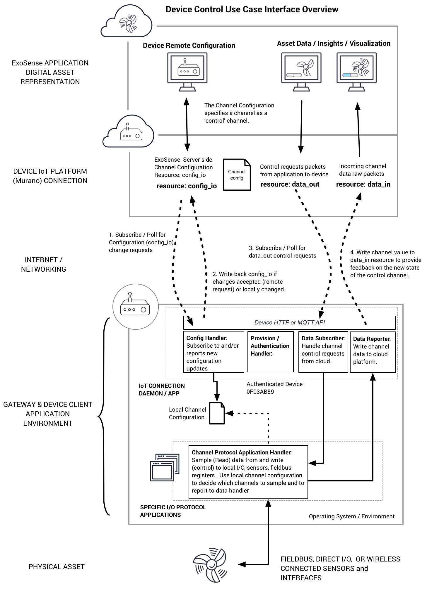

# ExoSense™️ Channel and Signal Data Schema


**Document Status:** Version 3.1 Draft

## Introduction
This document defines the information required to interface with ExoSense™️ from the “first mile” perspective of the connected device or gateway, as well as describing how this information is carried on into the “last mile” or client-side Application.

This document is meant for device developers building native support into the device or a proxy/gateway service for connection to ExoSense via an IoT service and for those looking to gain a deeper understanding of the architecture of channels and signals in the ExoSense environment.  It is not required for typical regular use of the ExoSense application itself.


**Who is this for:**
This document is meant for developers building device software to interact with ExoSenseand/or contributing to the development of ExoSense and related technologies.  

 It is not required for regular use of the ExoSense application itself, although may be helpful for creating end-user documentation.
 


### Definitions
The reader of this document should have a grasp on the following items or will need to for this document to make sense.

Term|Description|More Information
--|--|---
Murano|IoT Platform|[Murano Docs](https://docs.exosite.com)
ExoSense™️|Industrial IoT Application solution created and offered by Exosite|[Exosite](exosite.com)
Device/Gateway|An electronic device with an IP Connection sending data to a platform.  In this case is interacing with directly connected sensors, custom protocol connected sensors, or fieldbus connected equipment|
Sensors|Physical sensors connected to a Device/Gateway via wired or wireless protocol or IO (onboard).  Sensors are typically specific to a unit of measure - e.g. temperature, pressure, etc.| 
Channel|An ExoSense concept to identify an **individual stream** of information sent to ExoSense by an **unique device** that is specific to a type and with a specific unit of measure from that local physical environment (e.g. Temperature or Valve 1 status).  Can also be information such as memory on the device, status information, etc.|Typically a device is sending many channels of data for all of the sensors that are connected.
Signal|An ExoSense concept similiar to channel but is the part of a virtual Asset object that describes and stores the data.  Signals can be transformed, exported, visualzied, and have rules ran on them.  The source for a signal is typically a device channel but doesn't have to be.  The signal essentially subscribes to it's source.|
Asset|An ExoSense concept for digitizing an Asset (a machine, system, equipment, etc)|
Fieldbus|Industrial protocols like Modbus TCP or RTU, J1939, CANOpen, etc that allow machines, controls, equipment to have a standard way to talk to each other.|


## IoT Platform Device Interface Configuration Requirements

ExoSense uses the Murano IoT Platform device interface for it's device connectivity.  The following information details the specific resources used (HTTP resources / MQTT topics) regardless of the transport protocol  (MQTT or HTTP).

*Note: This document does not cover most details of how to interact with Murano’s IoT product/device interfaces including how to provision a device inside of a product defined in Murano, how to communicate with the [HTTP](http://docs.exosite.com/reference/products/device-api/http/) or [MQTT](http://docs.exosite.com/reference/products/device-api/mqtt/) APIs or other topics covered in [Murano’s public documentation](https://docs.exosite.com).*

**Device resource use is as follows:**

Resource Name|ExoSense Status|Who Can Write To|Description
--|--|--|---
`data_in`|supported|Device|Used to send data from device to cloud in the format defined in [Device Data Transport Schema](#device-data-transport-schema) section below
`config_io`|supported|Device / App|Used to share the complete configuration for a channels in the product.  This should be a 2-way synchronization meaning in the case of a self-configuring gateway, this would be written to by the gateway.  In a gateway that requires manual configuration from the application, this would be read by the gateway and cached locally.
`data_out`|supported|App|Used to send control requests from cloud to device in format defined in [Device Data Transport Schema](#device-data-transport-schema) section below
`config_applications`|supported|Device / App|Specifies configuration for the interfaces used by gateway protocol/fieldbus applications (i.e. “interface = /dev/tty0”)
`config_oem`|*reserved*|tbd|Settings for product names, and limits that constrain/override communications or collections of data per the manufacturers/OEMs requirements
`config_interfaces`|*reserved*|tbd|
`config_rules`|*reserved*|tbd|
`config_network`|*reserved*|tbd|

*Note: Generally do not recommend using custom resources with prefix of `config_`.*


## Device / Gateway Channel Configuration Schema
### Configuration Overview
This section defines the Channel Configuration object (sometimes called a device or gateway template).  This is the 'contract' for each individual device as to what channels of data it will be sending and optionally be controlling. The concept is data used by ExoSense flows as **Channels** to and from devices.  These device channel sources can then be mapped to digital twin Asset signals in the ExoSense application.

A gateway or device will require some level of configuration in order to do several things:

1.  Know what information to read off of / write to a fieldbus or IO
2.  Translate that information from machine-readable and terse input to Murano, back into contextual and human readable data ready to be taken into ExoSense - i.e. a signal object
3.  Provides a consistent way for standardizing interfaces so that analytic apps downstream are able to consume this common data type.

Of note for this section - the channel (io) configuration will be stored in the config_io product resource for the device as defined in Section 2 of this document.  The value in that resource will be considered the source of truth for the shared gateway configuration.  Meaning if a gateway is re-configured manually at the gateway, or if it is a gateway that is auto-configured by discovering the devices connected to it, the updated value must be pushed to that resource before RCM will become aware of any changes.

The configuration below wraps a user-defined value with a ${...}, and other names/keys are meant to be an exact match that will be used by ExoSense.  Some values for a key are filled in with example strings - noted with an “e.g.”.

**Channel Configuration Definition Description**
```yaml
# config_io channel definition 
last_edited: "${date_timestamp}" # *required* -  e.g. 2018-03-28T13:27:39+00:00 
last_editor" : "${edited_by}" # optional but recommended - String to mark as last editor, Person user name, "user", or "device"
meta : "${meta_string_information}" # optional - This is an open section for manufacturers to include useful meta info about the channels if they see fit
locked: ${locked_config_state} # optional - Boolean, marks config as not editable by UI, assume false if not present
channels: # "device channel" as opposed to an "asset signal"
  ######### Example channel config 1 - Basic Usage Options ############
  ${device_channel_id1}: # unique channel identifier string
    display_name: "${channel_name_string}" # *required* - Human readable channel name
    description: "${channel_description_string}" # optional - One-liner description 
    properties: 
      data_type: "${defined_type_enum}"  # *required* - See "types" section - in this case it could be "BOOLEAN" or "TEMPERATURE"
      primitive_type: "${defined_primitive_type_enum}" # optional - See "types" section - in this case it would be "BOOLEAN" or "NUMERIC"
      data_unit: "${unit_enum}" # *required* - Enumerated lookup to unit types for the given type
      precision: ${precision_number_of decimal_places} # optional but recommended, example value is 2 
      locked: ${locked_config_state} # optional but recommended - Boolean, marks as not editable by UI, defaults to false if not present
    protocol_config" : # optional - if used by device client
      sample_rate : "${sample_time_in_ms}" # optional - device client's sample rate for sensor
      report_rate : "${report_time_in_ms}" # optional but recommended - rate at which data sent to platform
      timeout : "${timeout_period_time_in_ms}" # optional but recommended - used by application to provide timeout indication, typically several times expected report rate
  ######### Example channel config 2 - Expanded Options - Remote Device Configuration Usage ############
  ${device_channel_id2}:   # unique channel identifier string
    display_name: "${channel_name_string}" # *required* - Human readable channel name
    description: "${channel_description_string}" # optional - One-liner description 
    properties: 
      data_type: "${defined_type_enum}" # *required* - See "types" section - in this case it would be "TEMPERATURE"
      primitive_type: "${defined_primitive_type_enum}" # optional - See "types" section - in this case it would be "NUMERIC"
      data_unit: "${unit_enum}" # *required* - Enumerated lookup to unit types for the given type
      precision: ${precision_number_of decimal_places}  # optional but recommended
      locked: ${locked_config_state} # optional but recommended - Boolean, marks as not editable by UI, defaults to false if not present
      ## Additional Channel Properties
      control: ${true|false}" # optional - defaults to false, whether channel is used for device control
      min: ${channel_min_number}  # optional - channel expected value min, applies to numberic type only
      max: ${channel_max_number}  # optional - channel expected value max, applies to numberic type only
      device_diagnostic: false # optional - Tells ExoSense that this is a “meta” signal that describes an attribute of the devices health
    protocol_config :  # optional - if used by device client 
      sample_rate : ${sample_time_in_ms} # optional - device client's sample rate for sensor
      report_rate : ${report_time_in_ms} # optional but recommended - rate at which data sent to platform
      timeout : "${timeout_period_time_in_ms}" # optional but recommended - used by application to provide timeout indication, typically several times expected report rate
      ## Addtional Channel Protocol Configuration Properties
      report_on_change : "${true|false}" # optional - default false (always report on start-up)
      down_sample : "${MIN|MAX|AVG|ACT}" # optional - Minimum in window, Maximum in window, running average in window, or actual value (assume report rate = sample rate)
      application : "${fieldbus_logger_application_name}" # optional - e.g. "Modbus_RTU"
      interface : "${path_to_interface}" # optional but required if using "application" e.g. "/dev/tty0/"
      app_specific_config : # optional but maybe be required depending on "application"
        ${app_specific_config_item1} : "${app_config_item1_value}"
        ${app_specific_config_item2} : "${config_item2_value}"
      ## Addtional Channel Protocol properties to transform raw data to the channel type / unit before reporting
      input_raw : # optional, used to pre-transform data type/unit from raw sensor to channel type, example voltage or bits (ADC) to Pressure 
        max : ${raw_input_max} # optional - above this puts the channel in error
        min : ${raw_input_max} # optional - above this puts the channel in error
        unit : "${raw_input_units}" # optional - e.g. "mA", reference only
      multiplier : ${number_to_be_multiplied_into_the_raw_value}" # optional used to pre-transform data type/unit from raw sensor to channel type, example 4-20 mA to Temperature 
      offset : ${offset} # optional used to pre-transform data type/unit from raw sensor to channel type, example 4-20 mA to Temperature 
    ## Advanced Usage / Not Available by Default - Used on Platform side only (Not Device)
    iot_properties: ## Advanced use only / for use by server side only (not device) - Not available by default
      multiplier: ${number_to_be_multiplied_into_the_raw_value}" # If not present set to 1
      offset: ${offset} # if not present assume 0
      data_type: "${defined_type_name}" # See "types" section - in this case it would be "TEMPERATURE"
      primitive_type: "${defined_primitive_type_name}" # Optional, See "types" section - in this case it would be "NUMERIC"
      data_unit: "${unit_enum}" # Enumerated lookup to unit types for the given type
      conversion_name: "${name}" # Name of conversion use to fill the multiplier and offset fields.
      min: ${converted_channel_min_number}  # optional - channel expected min after conversion
      max: ${converted_channel_max_number}  # optional - channel expected max after conversion
    control_properties: ## Optional - used to specify control parameters 
      range: # optional - for Numeric types only
        min: ${expected_minimum_value} # optional
        max: ${expected_maximum_value} # optional
      enum: # optional - provide a list of acceptable values 
        - ${accepted_value_1}
        - ${accepted_value_2}
        - ${accepted_value_n}
        
```
**Example config_io (JSON format)**
```json
{
  "last_edited": "2018-03-28T13:27:39+00:00 ",
  "last_editor": "user",
  "meta": {},
  "locked": false,
  "channels": {
    "001": {
      "display_name": "Valve Open Status",
      "description": "Machine Valve Open State Information",
      "properties": {
        "data_type": "BOOLEAN",
        "primitive_type": "BOOLEAN"
      },
      "protocol_config": {
        "sample_rate": 5000,
        "report_rate": 5000,
        "report_on_change": false,
        "timeout": 60000
      }
    },
    "002": {
      "display_name": "Temperature",
      "description": "Temperature Sensor Reading",
      "properties": {
        "data_type": "TEMPERATURE",
        "primitive_type": "NUMERIC",
        "data_unit": "DEG_CELSIUS",
        "precision": 2,
        "min": 16,
        "max": 35,
        "device_diagnostic": false,
        "locked": true
      },
      "protocol_config": {
        "sample_rate": 2000,
        "report_rate": 10000,
        "down_sample": "AVG",
        "report_on_change": false,
        "timeout": 300000,
        "application": "Modbus_RTU",
        "interface": "/dev/tty0/",
        "app_specific_config": {},
        "input_raw": {
          "max": 0,
          "min": 20,
          "unit": "mA"
        }
      }
    },
    "003": {
      "display_name": "Location",
      "description": "Location",
      "properties": {
        "data_type": "LOCATION",
        "primitive_type": "JSON",
        "data_unit": "LAT_LONG"
      },
      "protocol_config": {
        "report_rate": 60000,
        "timeout": 360000
      }
    },
    "004": {
      "display_name": "Valve Control",
      "description": "On / Off control",
      "properties": {
        "data_type": "BOOLEAN",
        "control": true
      },
      "protocol_config": {
        "report_rate": 60000,
        "timeout": 360000
      }
    },
    "005": {
      "display_name": "Temperature Threshold",
      "description": "On / Off control",
      "properties": {
        "data_type": "TEMPERATURE",
        "data_unit": "DEG_CELSIUS",
        "control": true
      },
      "protocol_config": {
        "report_rate": 60000,
        "timeout": 360000
      },
      "control_properties": {
        "range": {
          "min": 30,
          "max": 100
        }
      }
    }
  }
}
```


### Channel identifiers
Channel identifiers must be unique to the device context, in the device's config_io and recommend using no special characters or spaces, but must be a valid string. ExoSense uses a `"###"` scheme starting at `"001"`.  For devices that hard code their configuration and are not remotely configurable, any string can be used and can be more descriptive (e.g. "humidity").  Identifiers are not made viewable by users of the application, the display name is what users will see.

### Data types / units
The data type definitions are detailed below.  Each channel has a unique type and unit tied to the channel identifier that can not be changed after set.  The ExoSense application UI will not allow this.  Technically a device could overwrite a channel type, but this will have unknown consequences and will likely result in signals not functioning properly.  Information about primitive types is also in the Data Types Definition section.  

Data types and units for channels and signals are defined in the [ExoSense™️ Channel and Signal Data Types](data-types.md) document.  

### Display Name and Description
Used by the application to show the user a friendly name and description (optional) of the channel, which will provide them with better context to help map to asset signals.

### Locked channels
The 'locked' property is not required and is optional for use.  The entire configuration can be locked or channels can invidivually be locked.  If not set, defaults to 'false'.  A locked channel means that it is read-only on the application side.  Assumes the coniguration (config_io) has been set by the device and the device has no ability to take action based on changes on the application / cloud side.  

Locked channels and full configurations generally are used by devices that have a hard coded configuration, the channels are all defined and the config_io is uploaded by the device.  Devices can use a combination of locked and configurable channels, thus why the locked field can be found at both the full config level and per channel.  

### Report Rate
The interval for the device to report values to the cloud (ExoSense).  May be used in the application to determine gaps in data.  

### Timeout
The interval that is considered a timeout for a channel.  Can be the same as report rate but typically set at a larger interval to provide room for network slowness and reconnections.  Typically not used by the device but used by an Asset signal in the application to generate timeout events for the asset / device UI's, timeout events in the asset logs, and future possibilities.  *E.g. The device reports a channel every 1 minute but if it hasn't reported for 5 minutes, this is an event that may need to have a call to action for. *


### Control Channels
Channels can also be used to 'control' a device.  A simple example of this is to turn on/off a valve.  By default channels are not enabled to be controlled, but by setting the `control` property to `true`, ExoSense and the device will allow for sending commands from the application to the device.
A control channel uses all of the same schema in this document and devices must write the last state to the `data_in` resource, but the use of control channels requires the additional use of `data_out` resource.
[More details below](#device-control-interface) on the proper use and flow of control data.  


### Protocol configuration
Optionally used by the device to determine what application (protocol / interface) will be used and the specific details to get / set the information for the channel.  Used for fieldbus protocols (e.g. Modbus RTU) or custom applications such as a custom wireless handler or one that gathers data from local I/O on the hardware.  The protocol configuration parameters are optional to use, devices that are not configurable may not use this at all and therefore would not be specified.  

Devices that are configurable should use the protocol configuration properties to get / set data, convert it, and determine how often to sample (read locally) and report (to cloud).   

### IoT Properties
Advanced use only for allowing for server side conversion of data.  Not supported for normal ExoSense application use.  Not recommended.  Must not be used by the device.

### Device Channel to Asset Signal Configuration relationship
Signals inherit channel properites once created in the application.  Once a signal has been created through, changes to the channel's configuration do not automatically get applied to the signal's properties.  A signals properties, such as 'timeout', can be changed (if the application allows for it), but will not result in a change back down to the device channel.  

## Channel Data Schema 
Having a common shared channel configuration (a contract essentially) between the device and the cloud/application allows us to keep the actual data sent between devices and the cloud to a minimum - focusing only on the sending of values for channels rather than unnecessary configuration information that rarely changes.  

The resource used for writing channel values from devices to the cloud/application is “data_in”, as mentioned in the resource section.

There are 3 different scenarios of how we might want to send data - each one should build on the other, and they are:

**Single Data Value**

This is a very simple signal_id = value approach, but encoded in JSON.

```json
{ "${device_channel_id1}" : "${current_channel_value}" }
```


**Multiple signals written in a single payload**

```json
{
  "${device_channel_id1}" : "${current_channel_value1}",
  "${device_channel_id2}" : "${current_channel_value2}",
  "${device_channel_id3}" : "${current_channel_value3}",
  "${device_channel_id7}" : "${current_channel_value7}"
}
```
*Example with real data*
```json
{
  "001" : true,
  "002" : 78.233,
  "003" : {"lat":43.650883,"lng":-96.201642},
  "007" : "good"
}
```

This payload assumes each datapoint is to be recorded in the time series database at the time it is received.

*Note: Each channel is not required to send a value in each payload.  Some payloads may have a few channels, some may just have one, others may have all channels*

**Multiple signals, with some repeating, with different timestamps in a single payload:**

Utilize the Record API from Murano, and apply the array of signals to each timestamps data. 

[Murano Device Record API - HTTP](http://docs.exosite.com/reference/products/device-api/http/#record)

[Murano Device Record API - MQTT](http://docs.exosite.com/reference/products/device-api/mqtt/#report-data-to-historical-timestamps) 


This requires that the clock be synced on the gateway to the global network time via ntp which is used by our servers in our cluster. Our recommendation will be that the ntp server syncs with the gateway at least once every time the power is cycled on the gateway, and once per 12-24 hours of continuous operation time.

### Channel Error Handling
_Optional use, not required_

*Not Currently Used by ExoSense*

When an error occurs for a signal, the payload will change by adding the protected keyword property `__error` to the JSON root object like so:

```json
{
  "${channel_id1}" : "${current_channel_value1}",
  "${channel_id2}" : "${current_channel_value2}",
  "${channel_id7}" : "${current_channel_value7}",
  "__error" : {
    "${channel_id1}" : "${error_message_or_code}",
    "${channel_id3}" : "${error_message_or_code}" 
  }
}
```

The error object is a list of keys of the channel ids with an error, and then the value of that property is the error message, error code, or concatenation of any useful information that can be formatted into a string.

_Note: the device can report a channel data payload, even if the data is erroneous, but that is optional.  We will accept a chanel value and an error, just an error for a channel, or just a value.  All combinations are supported._


## Device Control Interface
_Optional use, not required_ 

Application use cases that require ExoSense to control device actions, such as turning on/off a valve can use control channels.  A control channel works and uses the same schema / format as regular channels.  Data types, units, and other properties are all used exactly the same.  

**Important Disclaimer**: *Device control from a remote server application requires common sense on what functionality and if a machine should actually be remotely controlled.  It is assumed that those building devices and systems that support remote control will provide local override capabilties and safety measures.  For example, if a device allows remote control of a garage door that there are physical sensors to sense and not allow a door to close if someone is in the way and ways to override the closing of the door at the physical location.*


### Example channel configuration for control
In this example, there is a valve that the device will open / close based on the channel `004`.  

```json
"004": {
  "display_name": "Valve Control",
  "description": "On / Off control",
  "properties": {
    "data_type": "BOOLEAN",
    "control": true
  },
  "protocol_config": {
    "report_rate": 60000,
    "timeout": 360000
  }
}
```

### Predefined control ranges and options
For channels that have a defined range of settings (assuming a numeric type of channel) or a set list of options, the configuration allows setting these ranges or options.

**Example Control Range**
In this example for a thermostat type application, a range is provided of acceptable values.  ExoSense will enforce allowing users to only set a value in this range.
```json
"009": {
  "display_name": "Thermostat Set Point",
  "description": "Set Point",
  "properties": {
    "data_type": "TEMPERATURE",
    "data_unit": "DEG_CELSIUS",
    "control": true
  },
  "control_properties": {
    "range": {
      "min": 20,
      "max": 40
    }
  },
  "protocol_config": {
    "report_rate": 60000,
    "timeout": 360000
  }
}
```

**Example Control Value Predefined Options**
In this situation, ExoSense and device are aware that only the provided options are available. 
```json
"009": {
  "display_name": "Garage Door Control",
  "description": "Control Options",
  "properties": {
    "data_type": "Number",
    "control": true
  },
  "control_properties": {
    "enum": [
      "open","close","half","auto"
    ]
  },
  "protocol_config": {
    "report_rate": 60000,
    "timeout": 360000
  }
}
```

### Device Control Interface

Devices that will use control channels must begin subscribing ('mqtt') or polling ('http') the `data_out` resource.  The data format is the same as `data_in` and any new data_out value will contain one or more new control channel requests.  The device must acknowledge it received the value by writing the same back to `data_out` (Murano Device API requirement) which tells the platform the value was received.  After taking action on the control requests, the device must write the new channel states back to data_in to close the loop so ExoSense knows the request finished.

**Device Steps:**
1. Subscribe or Poll `data_out`
2. On new `data_out` value, acknowledge received by writing back to `data_out`
3. Device takes control actions.
4. Device writes the channel states that were requested in `data_out` back to `data_in`


## Device Protocol Interfaces
_Optional use, not required_ 

This section defines the supported out of the box protocol interfaces and parameters.  OEMs can use their own application and interface parameters also but may not be supported in the application user interface (ExoSense).  

*Note: Only applicable to devices that are remotely configurable and use a fieldbus or fieldbus like configurable protocol for interacting with data / inputs / sensors.*

### Modbus TCP

Parameters for a channel's protocol configuration 'app_specific_config' field when using Modbus_TCP.
```yaml 
    ip_address : "IP_ADDRESS" # ip where the channel is being read as a string
    port : "INTEGER" # port to make the request on
    register_range : ["HOLDING_COIL", "INPUT_COIL", "INPUT_REGISTER", "HOLDING_REGISTER"]
    register : "INTEGER" # 0001-9999
    register_count : "INTEGER" # 1, 2, 4, 8, ...
    byte_endianness" : [ "little", "big" ]
    register_endianness" : [ "little", "big" ]
    evaluation_mode : ["floating point: ieee754", "signed integer", "unsigned", "string-ascii"]               
    bitmask : "HEXADECIMAL" # hex value for bits to mask out/pass-thru
```


### Modbus RTU

Parameters for a channel's protocol configuration 'app_specific_config' field when using Modbus_TCP.
```yaml 
    slave_id : "INTEGER" 
    register_range : ["HOLDING_COIL", "INPUT_COIL", "INPUT_REGISTER", "HOLDING_REGISTER"]
    register : "INTEGER" # 0001-9999
    register_count : "INTEGER" # 1, 2, 4, 8, ...
    byte_endianness" : [ "little", "big" ]
    register_endianness" : [ "little", "big" ]
    evaluation_mode : ["floating point: ieee754", "signed integer", "unsigned", "string-ascii"]               
    bitmask : "HEXADECIMAL" # hex value for bits to mask out/pass-thru
```

### CANopen

Parameters for a channel's protocol configuration 'app_specific_config' field when using CANopen.
```yaml
    node_id : "HEXADECIMAL" # e.g. "0x01"
    msg_index : "HEXADECIMAL"  # "PDO" starts at 0x180,"SDO" starts at 0x580, required
    offset : "INTEGER" # e.g. "0" bytes (determines starting byte position to read), default is 0, required
    data_length : "INTEGER" # e.g. "8" bytes (determines how many PDOs to read), default is 8, required
    evaluation_mode : [“REAL32”, “INT8”, “INT16”, “UINT16”, “UINT32”, “STRING”, “BOOLEAN”]
```

## Protocol Interface Application Configuration
*Note: Optional use for remotely configurable devices.*

The gateway / device applications that handle reading/writing for channels may have properties that need to be set that are useful for all channels using that protocol / interface.  For example, 10 channels may be set up to use Modbus_RTU at interface /dev/tty0.  The application that handles the modbus communication needs to know the interface details such as baud rate, etc.  

The resource used to hold this information that may then be communicated from cloud application to device is `config_applications`.  This resource is used by the device to know what interfaces and other application configuration parameters the user has selected.  These are not specific to the channel, but to the entire protocol application.  

The application protocols and interfaces listed below are used in `config_io` and therefore are used to drive channel configuration options in the user application. 

**Application Configuration (`config_applications`) Description**
```yaml
# config_applications channel definition 
last_edited: "{$date_timestamp}" # e.g. 2018-03-28T13:27:39+00:00 
last_editor" : "${edited_by}" # Person user name, "user", or "device"
applications: # device applications for handling channel protocols, used to show users their protocol / interfaces available for channel configuration. 
  ######### Example application 1 e.g. Modbus_RTU############
  ${application protocol 1}: # supported or custom protocol e.g. Modbus_RTU
    application_display_name: "Human readable application name" # Used in UI
    app_specific_config_options:  # Optional app specific parameters
      ${custom_param1}: ${custom_param1_value}
      ${custom_param2}: ${custom_param2_value}
    interfaces:
      # first interface for this application protocol 
    - interface: "${protocol_specific_hardware_interface}" # Specify hardware interface, depends on protocol
      custom_interface_param1: ${protocol_specific_value}  #specific to protocol
      custom_interface_param2: ${protocol_specific_value}  #specific to protocol
      custom_interface_paramN: ${protocol_specific_value}  #specific to protocol
      # second interface for this application protocol 
    - interface: "${protocol_specific_hardware_interface}" # Specify hardware interface, depends on protocol
      custom_interface_param1: ${protocol_specific_value}  #specific to protocol
      custom_interface_param2: ${protocol_specific_value}  #specific to protocol
      custom_interface_paramN: ${protocol_specific_value}  #specific to protocol
  ######### Example application 2 e.g. CANOpen############
  ${application protocol 2}: # supported or custom protocol e.g. Modbus_RTU
    application_display_name: "Human readable application name" # Used in UI
    interfaces:
      # first interface for this application protocol 
      - interface: "${protocol_specific_hardware_interface}" # Specify hardware interface, depends on protocol
        custom_interface_param1: ${protocol_specific_value}  #specific to protocol
```


**Example Full Application Configuration (`config_applications`)**
```json
{
  "last_edited": "2018-03-28T13:27:39+00:00",
  "last_editor": "user",
  "applications": {
    "Modbus_RTU": {
      "application_display_name": "Modbus RTU",
      "interfaces": [
        {
          "interface": "/dev/tty0",
          "baud_rate": 115200,
          "stop_bits": 1,
          "parity": "none",
          "data_bits": 8
        },
        {
          "interface": "/dev/tty4",
          "baud_rate": 9600,
          "stop_bits": 1,
          "parity": "even",
          "data_bits": 8
        }
      ]
    },
    "Modbus_TCP": {
      "application_display_name": "Modbus TCP",
      "interfaces": [
        {
          "interface": "eth0",
        }
      ]
    },
    "CANopen": {
      "application_display_name": "CANopen",
      "interfaces": [
        {
          "interface": "canA-10",
          "channel": "canA-10",
          "bitrate": 20000
        }
      ]
    },
    "CUSTOM_ACME_PROTOCOL": {
      "application_display_name": "Acme Custom Protocol",
      "interfaces": [
        {
          "interface": "/dev/tty3",
          "param1": "param1value",
          "param2": "param2value"
        }
      ],
      "app_specific_config_options":
      {
        "custom_option1":0,
        "custom_option2":"option2_value"
      }
    }
  }
}

```

### Specific Protocol Application Interface Configuration 
This section defines the supported protocol application configuration parameters (i.e. what goes into the `interfaces` array objects in `config_applications` ).

#### Modbus TCP Application Interface Options

Parameters for an application interface when using Modbus_TCP.  Device application must use appropriately.  
*Note: If no interface information provided, assumes device application will properly handle detecting interfaces or is hardcoded.*

```yaml 
    interface: "STRING" #e.g. eth0
```

**Example**
```json
{
  "last_edited": "2018-03-28T13:27:39+00:00",
  "last_editor": "user",
  "applications": {
    "Modbus_TCP": {
      "application_display_name": "Modbus TCP",
      "interfaces": [
        {
          "interface": "eth1",
        },
        {
          "interface": "wlan0",
        }
      ]
    }
  }
}

```

#### Modbus RTU Application Interface Options

Parameters for an application interface when using Modbus_RTU.  Device application must use appropriately. 

```yaml 
    interface: "STRING" #e.g. /dev/tty0
    baud_rate: [300, 600, 1200, 2400, 4800, 9600, 19200, 38400, 57600, 115200] #enum of standard baudrates, default to 19200
    stop_bits: [1,0,2]
    parity: ["even","odd","none"]
    data_bits: [8,7]
```

**Example**
```json
{
  "last_edited": "2018-03-28T13:27:39+00:00",
  "last_editor": "user",
  "applications": {
    "Modbus_RTU": {
      "application_display_name": "Modbus RTU",
      "interfaces": [
        {
          "interface": "/dev/tty0",
          "baud_rate": 115200,
          "stop_bits": 1,
          "parity": "none",
          "data_bits": 8
        },
        {
          "interface": "/dev/tty12",
          "baud_rate": 15200,
          "stop_bits": 1,
          "parity": "even",
          "data_bits": 8
        }
      ]
    }
  }
}

```


#### CANopen Application Interface Options

Parameters for an application interface when using CANopen.  Device application must use appropriately. 
```yaml
channel: "STRING" #e.g. canA-10
bitrate: [ 10000, 20000, 50000, 125000, 250000, 500000, 800000 and 1000000 ] #bit rate in bps
```
**Example**
```json
{
  "last_edited": "2018-03-28T13:27:39+00:00",
  "last_editor": "user",
  "applications": {
    "CANopen": {
      "application_display_name": "CANopen",
      "interfaces": [
        {
          "interface": "canA-10",
          "channel": "canA-10",
          "bitrate": 20000
        }
      ]
    }
  }
}

```

#### Custom Application and Protocol Options

Hardware application developers may support custom protocols by specifying their own applications in `config_applications` with appropriate `interfaces` and/or `app_specific_config_options`.

**Example**

```json
{
  "last_edited": "2018-03-28T13:27:39+00:00",
  "last_editor": "user",
  "applications": {
    "CUSTOM_ACME_PROTOCOL": {
      "application_display_name": "Acme Custom Wireless Protocol",
      "interfaces": [
        {
          "interface": "/dev/tty3",
          "param1": "param1value",
          "param2": "param2value"
        }
      ],
      "app_specific_config_options":
      {
        "custom_option1":0,
        "custom_option2":"option2_value"
      }
    }
  }
}

```

## Change log
### v3.1
* Adding device control support
* Changed Modbus RTU & Modbus TCP protocol configuration 'app_specific_config' key 'register_offset' to 'register'.
  

### v3.0
* Cleaned up formatting of examples and descriptions 
* Moved data types and units to seperate document "ExoSense™️ Channel and Signal Data Types"
* Updated "Specific Protocol Application Interface Configuration" (config_applications) interface information 
* Added support for 'locked' Channels
* Add iot_properties description for advanced Usage
* Cleaned up options for protocol parameters 
* Added primitive type field
* Added graphics to help with description of interface
