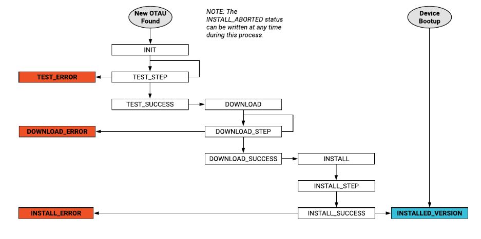

# Device OTA Update Schema

## Over-The-Air \(OTA\) Update Process Schema

### Introduction

This document defines the information required to list, issue \(send\), and communicate the status of an **Over The Air Update** or OTAU of device software packages. This is from the “first mile” perspective of the gateway or smart sensors. **OTA** and **OTAU** is a way of describing a remote device software update using a network connection.

## Device Software Package Update Process

The device software update process or "Over-The-Air Update" \(OTAU\) is defined in reference to the Murano IoT Platform and ExoSense application.

**Basic Flow Summary** 1. The OEM specifies a OTAU software package manifest file as content in a Murano product 2. A user application \(such as ExoSense\) will display this and any previous OTAU software package manifest files as available for a device \(or set of devices\) of that Murano Product type. 3. A user chooses a the OTAU software package and applies it in the application user interface. 4. The application will write to `config_otau` resource with the new otau state information \(aka tell the device what state it should be in and instructions on how to do that\) 5. The device sends updates to `otau_in` resource so the application can keep track of status for the device in regards to the requested OTAU software package state.

&lt; Block Diagram Here &gt;

### Terminology

| Term | Description |
| :--- | :--- |
| OTAU | Over-The-Air Update \(remote firmware, package, software update\) |

## Uploading / Listing OTAU Packages

### Using Murano Product Content for listing OTAU Packages

To post new OTAU software packages for devices, one must create a new content file in the Murano Product content area that contains the package informaiton.

Murano product content has an ID, the content which in this case will be zero bytes, and a TAG \(key/value pair\) that contains all the details about the package.

#### Content ID format

The ID must use a prefix of 'package_', the rest is up to the OEM but recommend using a format that devices the type of package, version information, etc.  
ExoSense will list all content with \`package_\` prefix.

Example: `package_oemname_prodname_prod_1-2-0`.

#### Content tag format

The tag is important as it is what ExoSense and any other Application UI's will use to list information about the package in addition to what to apply to the config command back down to the device. Tags in Murano Product Content files are key/value pairs.

**Key:**

`otau_info`

**Value:** The value is a JSON blob that contains information that ExoSense will use to display available packages with and the appropriate information that will be inserted into config\_otau as defined above. The JSON blob must be UTF-8 encoded before setting as value.

Before UTF-8 Encoding

```javascript
{
  "author":"<string>",
  "vendor":"<vendor_name>",
  "product":"<product_name",
  "config_otau": {
      "version": "<oem version>",
      "name": "<package name>",
      "description": "<Friendly description information>",
      "type": "FILE",
      "payload": "https://www.example.com/otau.txt"
  }
}
```

#### Example using Murano CLI to upload a new package to list.

The following is an example of how an OEM would make a new package available.

```text
> murano content upload package_acme_iotgw1_prod_1-0-1.json --tags otau_info=%7B%22author%22%3A%22Rob%20Updater%22%2C%22vendor%22%3A%22Acme%22%2C%22product%22%3A%22IoT%20Gateway1%22%2C%22config_otau%22%3A%7B%22version%22%3A%221.0.1%22%2C%22name%22%3A%22Production%201.0.1%20Package%22%2C%22description%22%3A%22Updated%20production%20units%20with%20bug%20fixes%22%2C%22type%22%3A%22FILE%22%2C%22payload%22%3A%22https%3A%2F%2Fwww.example.com%2Fotau.txt%22%7D%7D
```

## Applying a OTAU Package State Change to Devices

The following information details the process in which a OTAU package is applied to one or more devices by specifying a new `state` for the device to be in.

### Murano Product Resource Configuration Requirements

To support OTAU functionality, ExoSense expects that Murano products are configured with two specific resources regardless of the connection type: config\_otau and otau\_in.

| Resource Name | Cloud Writable | Description |
| :--- | :--- | :--- |
| config\_otau | Yes | [Issues a new OTAU state](ota_update_schema.md#otau-package-state-schema---config_otau) |
| otau\_in | No | [Communicates the status of an OTAU installation](ota_update_schema.md#otau-status-reporting-schema---otau_in) |

#### OTAU Package State Schema - config\_otau

This section defines the JSON schema for the `config_otau` resource in a Murano device, which is used to issue a new Package OTAU.

* **version** \(required\) - used to distinguish this OTAU from others \(eg. version number\).
* **name** \(required\) - human-readable name of OTAU \(eg. “Security Update”\).
* description \(optional\) - description of OTAU \(eg. “Prevents unauthorized access to system logs”\).
* **type** \(required\) - Defines the package type used by the gateway to determine how to handle the OTAU. These will be enumerations based on industry-accepted upgrade payloads. Types are listed here: [OTAU Package Type Definitions](ota_update_schema.md#otau-package-type-definitions) 
* **payload** \(required\) - Depends on the otau package type. See Section [OTAU Package Type Definitions](ota_update_schema.md#otau-package-type-definitions) for the expected value\(s\).

**OTAU Package Type Definitions**

These are the currently defined enumerations to represent OTAU types. More types will be added later as they become standardized in the OTAU workflow.

**FILE**

A flat file.

Example:

```text
https://www.example.com/otau.exe
```

**JSON**

An inline JSON object. Does not require separate download.

Example:

```javascript
{
    "key1": "value1",
    "key2": "value2",
    ...
}
```

**URL\_LIST**

JSON-formatted list of URLs.

Example:

```javascript
[
    "https://example.com/file1",
    "https://example.com/file2",
    "https://example.com/file3",
    ...
]
```

### OTAU Status Reporting Schema - otau\_in

This section defines the JSON schema for the otau\_in resource for a Murano device, which is used by gateways to communicate the status of an OTAU installation.

* **version \(required\)** - should match the version field in config\_otau.
* **status \(required\)** - enum of download / install statuses.
* **message \(optional\)** - custom status / error message.

#### OTAU Installation Status Definitions

These are the currently defined enumerations to represent OTAU installation statuses. It should be noted that not all gateways can/should implement all defined statuses, unless such level of granularity is desired.

| OTAU Installation Status | Description |
| :--- | :--- |
| INIT | Begin processing new OTAU. |
| TEST | Signals the start of the OTAU testing process. |
| TEST\_STEP | Incremental progress of OTAU testing \(eg. disk space checks, payload checksum, valid URL verification\) |
| TEST\_ERROR | OTAU Cannot be processed. |
| TEST\_SUCCESS | OTAU tests passed. Ready to download. |
| DOWNLOAD | Signals the start of the download process |
| DOWNLOAD\_STEP | Incremental progress of download. |
| DOWNLOAD\_SUCCESS | Download of update complete. Ready to install. |
| DOWNLOAD\_ERROR | Unable to download update. |
| INSTALL | Signals the start of the install process. |
| INSTALL\_STEP | Incremental progress of installation. |
| INSTALL\_ABORTED | The install was intentionally aborted \(i.e. cancel request due to wrong version\). This can be set at any time during the OTAU test, download, install process. |
| INSTALL\_ERROR | Install exited with unexpected code. |
| INSTALL\_SUCCESS | Installation complete. |
| INSTALLED\_VERSION | Explicitly reflects current state of application. This should be set following a successful update or device bootup. |

#### Examples of OTAU Status Updates

The following are examples of messages from the device. Reminder, must be sent as a string via the Murano API.

```javascript
{
    "version": "1.2.4",
    "status":  "TEST_ERROR",
    "message": "Not enough memory (required: 1024MB, available: 512MB)."
}
```

```javascript
{
    "version": "656764202e0c6411cce167da8a2269481b2f4f6a",
    "status":  "DOWNLOAD_STEP",
    "message": "Downloading file 2 of 5"
}
```

```javascript
{
    "version": "2.0.5-stable",
    "status":  "INSTALLED_VERSION",
    "message": ""
}
```

### Status Sequence Diagram



## Change log

